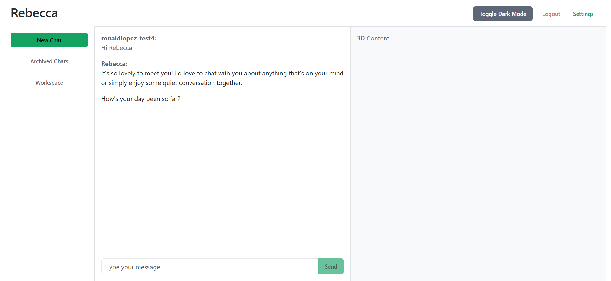

# Flask, React, Redux, and Three.js Integration Example

This project demonstrates a scalable application integrating Flask, React, Redux, and Three.js, with PostgreSQL as the database and a well-structured code organization for maintainability and scalability.


---

## Table of Contents
- [Flask, React, Redux, and Three.js Integration Example](#flask-react-redux-and-threejs-integration-example)
  - [](#)
  - [Table of Contents](#table-of-contents)
  - [File Structure](#file-structure)
  - [Features](#features)
  - [Setup Instructions](#setup-instructions)
    - [Backend Setup](#backend-setup)
    - [Frontend Setup](#frontend-setup)
  - [Backend Configuration](#backend-configuration)
    - [Flask Configuration](#flask-configuration)
  - [Frontend Configuration](#frontend-configuration)
  - [Vite Configuration](#vite-configuration)
  - [Deployment](#deployment)
  - [Contributing](#contributing)
  - [License](#license)

---

## File Structure

The project follows a modular structure to separate concerns and ensure scalability:

```
project/
|-- backend/
|   |-- app.py
|   |-- routes/
|   |   |-- __init__.py
|   |   |-- auth_routes.py
|   |   |-- chat_routes.py
|   |-- utils/
|   |   |-- __init__.py
|   |   |-- db_utils.py
|   |-- data/
|   |   |-- rebecca_dataset.json
|   |-- requirements.txt
|-- frontend/
|   |-- public/
|   |-- src/
|   |   |-- components/
|   |   |   |-- Header.jsx
|   |   |   |-- Sidebar.jsx
|   |   |   |-- ChatContainer.jsx
|   |   |-- App.jsx
|   |   |-- index.css
|   |-- package.json
|   |-- vite.config.js
|-- .env
|-- requirements.txt
```

---

## Features

- **User Authentication**: Secure user registration and login using JWT.
- **Chat Functionality**: Real-time chat interface with message history.
- **3D Visualization**: Integration with Three.js for 3D graphics.
- **State Management**: Efficient state management using Redux.
- **Database Integration**: PostgreSQL for data storage and retrieval.
- **Responsive Design**: Mobile-friendly UI with responsive design.
- **Environment Configuration**: Use of `.env` files for managing environment variables.
- **Proxy API Requests**: Vite configuration to proxy API requests to the Flask backend.
- **Text-to-Speech**: Convert text messages to speech using a text-to-speech API with Parler-TTS.
- **Markdown Formatting**: Use `react-markdown` to format chat messages.

---

## Setup Instructions

### Backend Setup
1. **Create a Virtual Environment**:
   ```bash
   python -m venv .venv
   source .venv/bin/activate   # On Windows: .venv\Scripts\activate
   ```
2. **Install Dependencies**:
   ```bash
   pip install -r requirements.txt
   ```
3. **Run Flask Server**:
   ```bash
   python backend/app.py
   ```
   The backend server will be available at `http://127.0.0.1:5000`.

### Frontend Setup
1. **Install Node.js Dependencies**:
   ```bash
   cd frontend
   npm install
   ```
2. **Run Development Server**:
   ```bash
   npm run dev
   ```
   The React app will be available at `http://127.0.0.1:5173`.

---

## Backend Configuration

### Flask Configuration
1. **Serve Static React App**: Update `app.py` to serve React's static files and API routes:

   ```python
   from flask import Flask, send_from_directory, request, jsonify
   from routes.auth_routes import auth_routes
   from routes.chat_routes import chat_routes
   from flask_cors import CORS
   from utils.db_utils import connect_db
   from dotenv import load_dotenv
   import os
   import jwt

   app = Flask(__name__, static_folder='../frontend/dist', static_url_path='')
   CORS(app)

   load_dotenv()

   # JWT secret key
   app.config['SECRET_KEY'] = os.getenv('SECRET_KEY', 'your_secret_key')

   # Register blueprints
   app.register_blueprint(auth_routes, url_prefix='/auth')
   app.register_blueprint(chat_routes, url_prefix='/api')

   # Serve React static files
   @app.route('/')
   @app.route('/<path:path>')
   def serve_react_app(path=''):
       if path and os.path.exists(os.path.join(app.static_folder, path)):
           return send_from_directory(app.static_folder, path)
       return send_from_directory(app.static_folder, 'index.html')

   if __name__ == '__main__':
       app.run(debug=True)
   ```

2. **API Endpoints**:
   - Auth routes: `/auth/login`, `/auth/register`
   - Chat routes: `/api/chat`

3. **Database Utilities**: Utilize `db_utils.py` for PostgreSQL queries.

---

## Frontend Configuration

1. **React Router**:
   Ensure routing is configured in `src/App.jsx`:

   ```javascript
   import React from 'react';
   import { BrowserRouter as Router, Routes, Route, Navigate } from 'react-router-dom';
   import Register from './pages/Register';
   import Login from './pages/Login';
   import Chat from './pages/Chat';
   import Home from './pages/Home';
   import './App.css';
   import './bootstrap.css';

   const App = () => {
     const isAuthenticated = !!localStorage.getItem('token');

     return (
       <Router>
         <Routes>
           <Route path="/" element={isAuthenticated ? <Home /> : <Navigate to="/login" />} />
           <Route path="/register" element={<Register />} />
           <Route path="/login" element={<Login />} />
           <Route path="/chat" element={isAuthenticated ? <Chat /> : <Navigate to="/login" />} />
         </Routes>
       </Router>
     );
   };

   export default App;
   ```

2. **Components**:
   - Split `index.html` into reusable React components (e.g., `Header`, `Sidebar`, `ChatContainer`).

3. **Redux Store**:
   Use Redux Toolkit to manage the global state (`store/chatSlice.js`).

4. **API Integration**:
   Use `fetch` or `Axios` to interact with Flask APIs.

---

## Vite Configuration

1. **Proxy API Requests**:
   Add proxy settings in `vite.config.js`:

   ```javascript
   import { defineConfig } from 'vite';
   import react from '@vitejs/plugin-react';

   export default defineConfig({
     plugins: [react()],
     server: {
       proxy: {
         '/auth': 'http://127.0.0.1:5000',
         '/api': 'http://127.0.0.1:5000',
       },
     },
   });
   ```

---

## Deployment

1. **Backend Deployment**:
   Deploy the Flask app using platforms like Heroku, Render, or AWS.

2. **Frontend Deployment**:
   Deploy the React app using Netlify or Vercel. Ensure the build files are served from Flask in production.

3. **Environment Variables**:
   Use `.env` files to manage sensitive configurations for both backend and frontend.

---

## Contributing

1. Fork the repository.
2. Create a feature branch:
   ```bash
   git checkout -b feature-name
   ```
3. Commit your changes:
   ```bash
   git commit -m "Add feature description"
   ```
4. Push to the branch:
   ```bash
   git push origin feature-name
   ```
5. Open a Pull Request.

---

## License

This project is licensed under the MIT License. See the `LICENSE` file for details.

